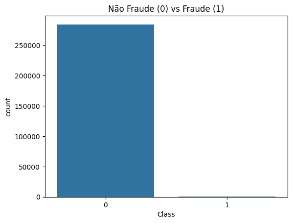
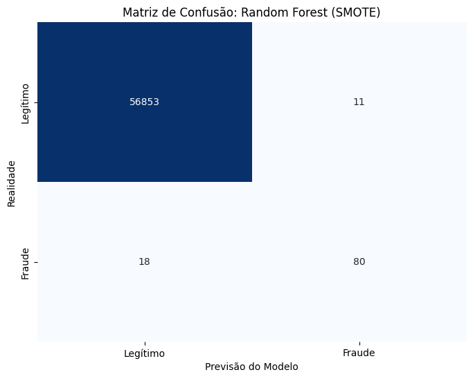

# Detecção de Fraude em Cartões de Crédito

## O Problema de Negócio
No mercado financeiro, a detecção de fraude não é apenas sobre identificar crimes, mas sobre **equilíbrio**.
1.  **Falsos Negativos (Fraude não detectada):** O banco perde dinheiro diretamente (prejuízo financeiro).
2.  **Falsos Positivos (Alarme falso):** O cartão de um cliente honesto é bloqueado. Isso gera frustração, constrangimento e custo operacional (SAC).

O desafio técnico deste dataset é o **desbalanceamento extremo**: apenas **0.17%** das transações são fraudes. Um modelo comum diria que "tudo é legítimo" e teria 99.8% de acurácia, mas falharia completamente em sua missão.

---

## Análise Exploratória e Dados
O dataset contém transações de cartões de crédito europeus durante dois dias.
* **Total de transações:** 284.807
* **Fraudes:** 492
* **Variáveis:** V1 a V28 (anonimizadas via PCA), Time e Amount.

O primeiro passo foi visualizar esse desbalanceamento, que justifica o uso de técnicas de amostragem sintética.

*(Gráfico mostrando a disparidade entre transações normais e fraudes)*

---

## Metodologia (Pipeline)

Para resolver o problema, adotei a seguinte estratégia:

1.  **Pré-processamento:**
    * Normalização das colunas `Amount` e `Time` usando **RobustScaler** (ideal para dados com outliers financeiros).
    * Separação de dados de Treino e Teste **antes** de qualquer balanceamento (para evitar *Data Leakage*).

2.  **Balanceamento (SMOTE):**
    * Utilizei o **SMOTE (Synthetic Minority Over-sampling Technique)** apenas nos dados de treino.
    * Isso cria exemplos sintéticos de fraudes baseados nos vizinhos mais próximos (KNN), permitindo que o modelo aprenda padrões reais de fraude sem viciar em maioria.

3.  **Modelagem:**
    * Teste A: **Regressão Logística** (Baseline).
    * Teste B: **Random Forest Classifier** (Modelo Final).

---

## Resultados e Comparação de Modelos

A métrica principal para este projeto **não é a Acurácia**, mas sim o **Recall** (Capacidade de detectar fraudes) e a **Precisão** (Capacidade de não incomodar clientes legítimos).

### 1. Regressão Logística (Baseline)
O modelo foi muito sensível, detectando a maioria das fraudes, mas gerando um volume inaceitável de alarmes falsos.
* **Recall (Fraude):** 92% (Excelente)
* **Falsos Positivos:** 1.434 clientes bloqueados indevidamente.

### 2. Random Forest (Modelo Vencedor)
O Random Forest conseguiu entender melhor as nuances dos dados, mantendo uma alta detecção de fraude, mas eliminando drasticamente os erros com clientes honestos.

* **Recall (Fraude):** ~82%
* **Falsos Positivos:** **Apenas 11** (Redução de 99% nos alarmes falsos comparado à Regressão Logística).

*(Matriz de Confusão do Random Forest nos dados de teste)*

---

## Conclusão de Negócio

A escolha do modelo **Random Forest** se mostrou superior para o ambiente de produção.
Embora a Regressão Logística tenha detectado matematicamente mais fraudes (10 a mais), o custo de bloquear **1.400 clientes legítimos** tornaria a operação inviável.

O modelo final entrega:
1.  Alta segurança (detecta mais de 80% das fraudes).
2.  Excelente experiência do usuário (taxa de falso positivo insignificante).

---

## Tecnologias Utilizadas
* **Linguagem:** Python
* **Manipulação de Dados:** Pandas, NumPy
* **Machine Learning:** Scikit-Learn (Logistic Regression, Random Forest)
* **Dados Desbalanceados:** Imbalanced-learn (SMOTE)
* **Visualização:** Matplotlib, Seaborn
